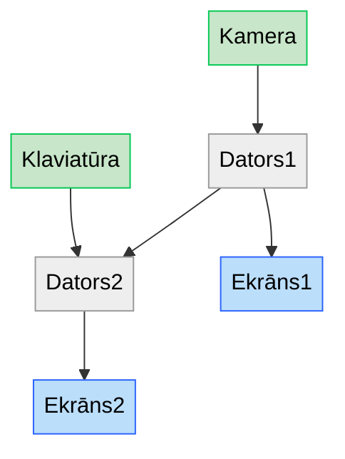

# Zinātnieku nakts 2026

Šajā repozitorijā ir kods un tā lietošanas apraksts, ko lietoju savā Zinātnieku nakts aktivitātē "Dzīvā attelu analīze".

## Shemātiskais zīmejums

```mermaid
---
config:
  layout: fixed
---
flowchart TB
    n3["Kamera"] --> n1["Dators1"]
    n1 --> n2["Dators2"] & n5["Ekrāns1"]
    n2 --> n4["Ekrāns2"]
    n6["Klaviatūra"] --> n2

    n3@{ shape: text}
    n1@{ shape: text}
    n2@{ shape: text}
    n5@{ shape: text}
    n4@{ shape: text}
    n6@{ shape: text}
     n3:::Ash
     n1:::Ash
     n2:::Ash
     n5:::Ash
     n4:::Ash
     n6:::Ash
    classDef Ash stroke-width:1px, stroke-dasharray:none, stroke:#999999, fill:#EEEEEE, color:#000000
    style n3 fill:#C8E6C9,stroke:#00C853
    style n5 fill:#BBDEFB,stroke:#2962FF
    style n4 fill:#BBDEFB,stroke:#2962FF
    style n6 fill:#C8E6C9,stroke:#00C853
```
